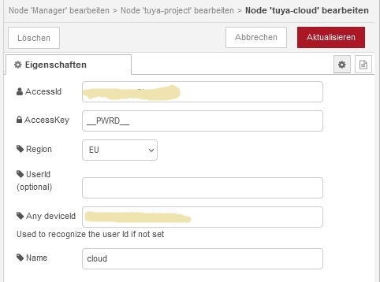
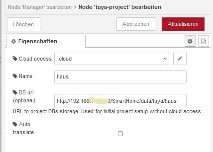
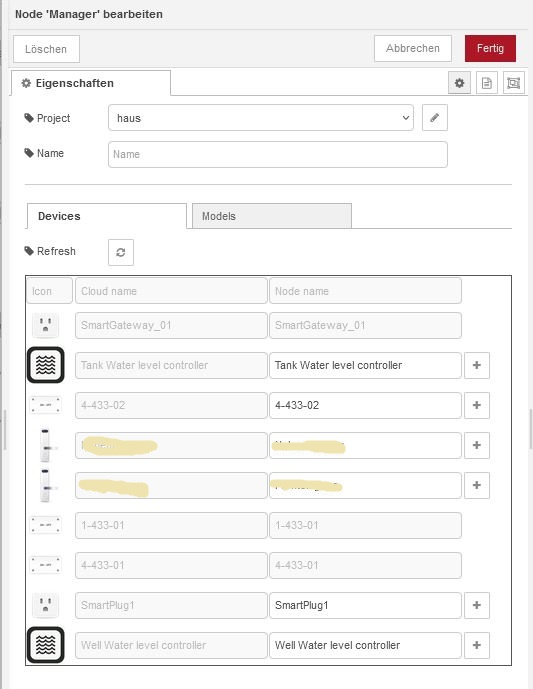
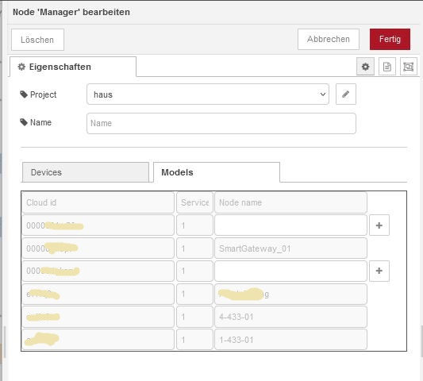

# node-red-contrib-tuya-devices
Support for Tuya devices in SmartHome projects using [Node-RED](https://nodered.org/).  
The goal of the project is to allow using local devices supports Tuya in Node-Red

## Getting Started

Prerequisites: [Node-RED](https://nodered.org) installation. For details see [here](https://nodered.org/docs/getting-started/installation).

Install via npm

```shell
$ cd ~/.node-red
$ npm install node-red-contrib-tuya-devices
```
then restart node-red

The Tuya devices are represented by config Nodes (single Node per device). The flow Nodes references a device node and can exists multiple times in different flows. It can be defined a project object to group and control all Tuya devices in the local network. The IP addresses of the devices will be detect automaticaly. If configured a cloud access the device capabilities will be downloded and cached localy.

## First steps
Insert Tuya manager node. 
In the manager config form:  
- Add new tuya-project. 
  In the project config form:  
  - set the name for the project
  - Add new tuya-cloud. 
    In the cloud config form:  
    - set the AccessID, AccessKey and Any deviceId (needed to recognise the userId and all devices mapped to the same user account)
    - optional can be set the Tuya cloud userId if known and a name for the config node
  - Optional can be added new MQTT broker. It will be used for all Tuya devices in the project. The device data can be accessed in the broker with MQTT topic "tuya/(deviceId)/tele/(dp)"

## Usage
If the cloud configuration is correct and the manager node has received at least once a message with topic 'updateDevices' all mapped devices will be listed in the config. The device capabilities will be cached localy. With the plus button can be added a config node for every local device. This config nodes contains all setting nedded to use the device localy and can be selected in the configuration of the Tuya device nodes. 
The device nodes can be easy connected to dashboard ui nodes (see example below). For this the single DP must be selected or a topic must be used to select a rigth DP, e.g by using of switch node. If device capabilites exists in local cache (e.g. after once successfully loaded from cloud) the device commands can be requestet by message usung topic 'dispatchCommands' (as in examle). A whole data model for the device can be requested by message with topic 'getDataModel'. 

## Examples
- [Tuya power device flow examle](./img/power_dev.json)
- [Tuya themperature and humidity sensor device flow examle](./img/th_sensor.json)
- [Tuya multifunctional alarm device flow examle](./img/alarm.json) for control and configuration

## Changelog

### v1.3.3
- Add extra support for security cams (category 'sp'), e.g. PTZ
- Added support for device context in cache
- Improve cache functionality
- Make more robust the usage of ARP functionality (due to problems on some platforms)

### v1.3.2
- No functional changes

### v1.3.1
- Fixed critical error on load device model
- Added clearCache command (msg: {"topic":"clearCache"}). Optional message parameters: "complete" and "backup", both of type boolean
- Make Cache syncronisation more robust in case of connection problems
- Added possibility to sort translations (e.g. after manual edit)
- Added link to cache explorer in the project GUI

### v1.3.x
- Add possibility to restart Node-Red (service or application) running on Debian system (e.g. RaspberryPI) over the GUI by send message with topic "restartNodeRed" to a Tuya Manager node. For development purposes Node-Red can be startet by the script (~/.node-red/start-nodered.sh) to make possible to restart it.
- Added support of MQTT for Tuya devices (Beta status). The activation and configuration can be make in a Tuya project node. All devices in the project uses the same MQTT broker. 

### v1.2.x
- Refactoring to use 'tuya-devices' library
- Added support for MAC address and Tuya version to the local device
- Added tuya explorer (Beta, e.g. http://localhost:1880/resources/node-red-contrib-tuya-devices/index.html if no project configured or
  http://{ip-or-host}:1880/resources/node-red-contrib-tuya-devices/{project-name}.html)
- Improve device scanner
- Local devices can be used by IP or MAC address
- added dynamic generation of device commands based on model definitions
- Added extension for device category "mal". Especially for treatment of sub-devices

### v1.1.x
- Make possible to use local devices connected by gateway
- Refactoring local chache
- List cloud devices and models in the manager node configuration and create config nodes using '+' button
- Model elements can be manualy translated by editing of the file "translations.json" in .node-red\projects\node-red-contrib-tuya-devices\resources\{projectname}\

### v1.0.x
- Initial implementation
- Supports WLAN Tuya devices

## TODO
- filter models by selected room in manager view
- hide space column in manager view devices tab if room selected
- add room selection control in the manager view devices tab
- link the device settings view to the device row in manager view
- make possible to disable device in the admin page
- flow examples
- Make possible to translate cloud tokens (service descriptions) to english. Existing cache can be translated using manager command with topic 'translateDeviceModels'. 
  

## Disclaimer
The software is provided as-is under the MIT license. The author cannot be held responsible for any unintended behaviours.

## Thanks
If you like our ideas and want to support further development, you can donate here:  
[](https://paypal.me/tasmotas)
[](https://www.buymeacoffee.com/smarthomenodes)

## Screenshots
 
 
 
 
 
