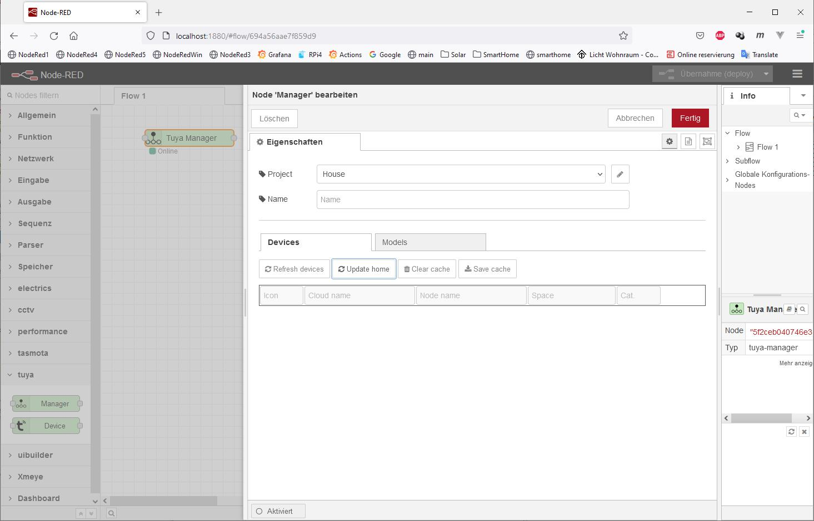
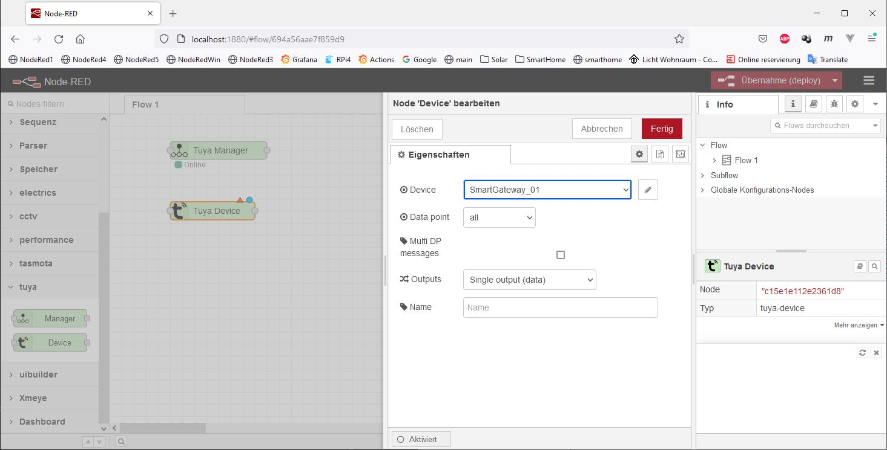

# node-red-contrib-tuya-devices
Drag and drop Manager node
  
Doble click on the node
  
Click on the pen to add new project
  
Type some name (here is House) and go to tab Cloud
  
Click on the pen to add new Clud object
  
Fill the fields AccessId, AccessKey and Any deviceId and accept (click "Update" [en] / "Hinzufügen" [de])
Also accept the Manager settings  
Now we have:
  
Acept this dialog and delpoy to Node-Red (Red button in Node-Red bar)
  
The tables in my cache are still (almost) empty, except for two static files: manifest.json and overloads.json
  
Now open again manager GUI and click "Update home"
  
Manager Node has green state -> connected to Cloud.
In my cache are now two more tables filled: users.json and homes.json
  
Click on "Refresh devices" (only once) and wait. This can take 1-2 minutes. At the end the devices appear in the table
  
The tables devices.json and models.json contains data
  
Now I can edit the node name for some device (optional) ant then click on + button to add this device to my Node-Red project.
I select "SmartGateway_01". Now ist the button + hidden and the name isn't editable
  
Accept and deploy (! always deploy after add new devices before use this)
Drag and drop a new Device node and double click on this
  
Accept and deploy.
If the device is online and in the same IP network it must be state "Online" (geen), else the state is yellow as my device 
The data points (DPS) of the device are listed in the combo box
  
If you select "Multi outputs" 
  
and accept an output will be shown for every data point. The first one is for control messages. If you go with mouse over the output you will be seen a tooltip with DPS number and code
  
The code is used as topic for the input and output messages

